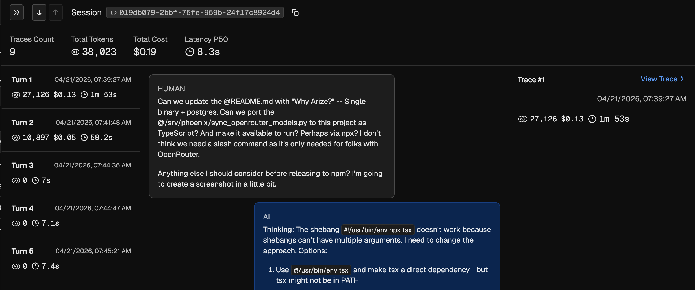
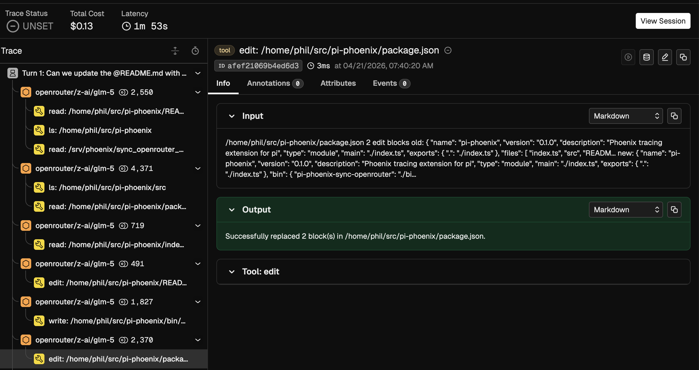

# pi-phoenix

Phoenix tracing extension for [pi](https://github.com/mariozechner/pi-coding-agent). It sends OpenInference traces to Arize Phoenix so you can inspect pi sessions, prompts, model calls, and tool executions.

## Why Arize?

Single binary + postgres. No ElasticSearch, no Kafka, no distributed tracing infrastructure to manage. Self-host in one container, or use the cloud offering.

## Screenshots

### Session overview



### Trace detail



## Trace model

```text
pi.session
├── Turn 1: describe the bug...
│   ├── anthropic/claude-sonnet-4
│   ├── read
│   └── bash
├── Turn 2: fix it
│   ├── anthropic/claude-sonnet-4
│   └── edit
└── ...
```

- `pi.session`: one root session context
- `Turn n`: one span per agent run
- `llm`: one span per assistant/model response
- `tool`: one span per tool execution

## Install with pi

### npm

```bash
pi install pi-phoenix
```

### GitHub

```bash
pi install github:philipbjorge/pi-phoenix
```

### Local checkout

```bash
pi install /home/phil/src/pi-phoenix
```

## Usage

### Local Phoenix

```bash
docker run -d -p 6006:6006 arizephoenix/phoenix:latest
pi -e /home/phil/src/pi-phoenix/index.ts
```

### Phoenix Cloud

```bash
export PHOENIX_COLLECTOR_ENDPOINT=https://app.phoenix.arize.com
export PHOENIX_API_KEY=your-api-key
export PI_PHOENIX_PROJECT=my-project
pi -e /home/phil/src/pi-phoenix/index.ts
```

## Configuration

| Variable | Default | Description |
| --- | --- | --- |
| `PI_PHOENIX_ENABLE` | `true` | Enable or disable tracing |
| `PI_PHOENIX_PROJECT` | git repo root basename or cwd basename | Project name shown in Phoenix |
| `PHOENIX_COLLECTOR_ENDPOINT` | `http://localhost:6006` | Phoenix server URL |
| `PHOENIX_API_KEY` | unset | API key for Phoenix Cloud |
| `PI_PHOENIX_BATCH` | `false` | Enable batch exporting |
| `PI_PHOENIX_MAX_ATTR_BYTES` | `16384` | Max bytes captured per span attribute |

## Development

```bash
cd /home/phil/src/pi-phoenix
npm install
npm run typecheck
```

## OpenRouter model sync via npx

If you use OpenRouter, you can sync OpenRouter model pricing into Phoenix for accurate cost tracking:

```bash
npx pi-phoenix-sync-openrouter --dry-run
npx pi-phoenix-sync-openrouter
PHOENIX_GRAPHQL=http://your-phoenix:6006/graphql npx pi-phoenix-sync-openrouter
```

Options:
- `--dry-run`: Print actions without mutating Phoenix
- `--limit N`: Process only the first N models

## License

MIT
